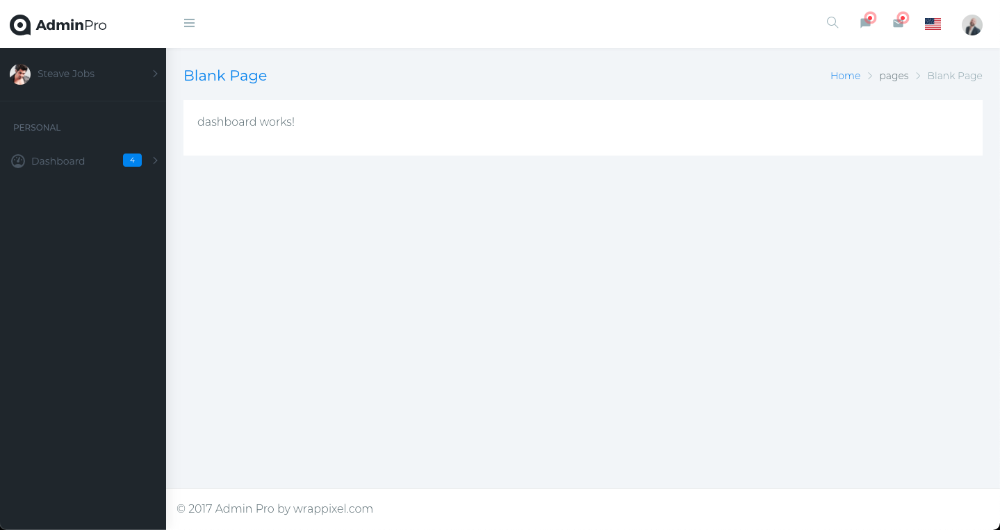

# AdminPro

This project was generated with [Angular CLI](https://github.com/angular/angular-cli) version 12.2.1.

## Development server

Run `ng serve` for a dev server. Navigate to `http://localhost:4200/`. The app will automatically reload if you change any of the source files.

## Intro

I've created this project to learn better Angular. This is the first of many projects I'm doing to get my expert Angular Certification.

## Previews
* log in 

* register

* home page

* notifications

* messages

* countries

* personal

* profile

* Error 404 Page not found

